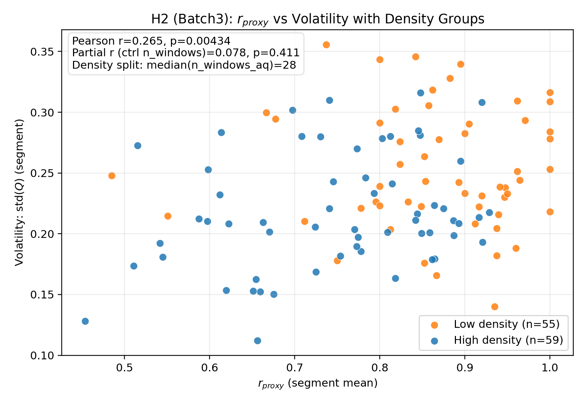

# Note07：经验验证收敛稿（按 PI Two‑Tier 叙事）

> 目标：把 Note07 的经验验证“收敛成可写进论文的版本”，清晰交代：哪些假设在真实数据中得到支持、哪些受限于数据分辨率/连续性而无法稳定评估。  
> 关键原则：不再新增数据清洗/迭代，只整理既有结果与图表，并如实呈现负结果（invalidation findings）。

更新时间：2025‑12‑20

---

## 0. 叙事结构（PI 最终决策）

我们不宣称在经验数据中“完美验证”全部理论假设，而是明确展示：在真实且有噪声的社交媒体数据里，

- 哪些规律是**鲁棒的**（Primary findings）
- 哪些规律在当前数据分辨率/连续性下**难以捕捉**（Secondary / limitations）

因此采用 **Two‑Tier Validation**：

1) **结构性（横截面）验证**：用多话题混合池（更大的 $r_{\text{proxy}}$ 方差）检验 H2（及 H3 的启发式结论）。  
2) **动力学（时间演化）验证**：用单话题（更“干净”的时序）检验 H1/H4，但接受 H4 可能受限于数据连续性与事件数。

---

## 1. 指标与口径（与代码一致）

**理论映射变量**

- 序参量（极化）：$Q=X_H-X_L$
- 活跃度：$a=X_H+X_L=1-X_M$
- 媒体生态代理（正反馈占优程度）：
$$
r_{\text{proxy}}=\frac{n_{\text{wemedia}}}{n_{\text{wemedia}}+n_{\text{mainstream}}+n_{\text{government}}}
$$
其中 `government` 并入“官方叙事”，纳入分母（与 `src/empirical/time_series.py` 口径一致）。

**时间聚合与段内统计**

- 聚合频率：`freq=4H`
- 段内统计：`segment=W`（周）
- `min_posts_public=5`（master/batch3/all）；单话题较稀疏时允许 `min_posts_public=4` 作为对照

**H4（CSD / early warning）**

- rolling：`roll_win=12`（约 48h）
- 对齐回看：`pre=24`（约 96h）
- Placebo：在同一团簇/同一连续块结构内置换事件标签，报告 one‑sided p（见 `scripts/run_note7_empirical.py`）

---

## 2. Table 1：假设检验汇总（PI 要求）

说明：

- 该表按 PI 指令给出 **H1/H2 的相关系数与 p 值**；H4 给出 **Placebo p 值**或“事件不足”。  
- `All` 指 **master+batch3 合并去重**后得到的全量池（脚本内部自动生成）。

| Hypothesis | Batch1 (single topic, strict) | Batch3 (expanded) | All (master+batch3) |
|---|---|---|---|
| **H1** Activity → Jump | Pearson r = −0.349 (p = 0.293)\* | Pearson r = 0.159 (p = 0.090) | **Pearson r = 0.241 (p = 0.00798)** |
| **H2** $r_{\text{proxy}}$ → Volatility | Pearson r = 0.098 (p = 0.774) | **Pearson r = 0.265 (p = 0.00434)** | Pearson r = 0.065 (p = 0.484) |
| **H4** CSD (AC1/Var ↑ before jumps) | events = 2；placebo p(AC1)=0.525；p(Var)=0.537 | events = 13；placebo p(AC1)=0.571；p(Var)=0.905 | events = 16；placebo p(AC1)=0.359；p(Var)=0.843 |

\* Batch1 的结果对 `min_posts_public` 与 `segment` 较敏感；这里固定为 `freq=4H, segment=2D, min_posts_public=4`（与当前单话题可检验性最匹配）。  
额外稳健性诊断：Batch3 的 H2 在控制段内样本量 `n_windows_aq` 后，部分相关不显著（r=0.078, p=0.411），提示“密度”是重要混杂因素。

---

## 3. Figure 2（PI 指定）：H2 散点图 + 密度分组

> 目的：直观展示 $r_{\text{proxy}}$ 与波动性的相关，以及“数据密度（段内有效窗口数）”的混杂效应。

<figure>
  
  <figcaption><b>Figure 2</b> | H2 (Batch3): $r_{\text{proxy}}$ vs volatility, colored by density groups (median split on segment sample size). Raw correlation is significant, while partial correlation controlling for segment window count becomes non‑significant, indicating density as a confounder.</figcaption>
</figure>

## 3.1 经验验证主图索引（现有产物）

为便于在正文/附录引用，下列图均已在本仓库生成：

- 基础时序（Q/a/r_proxy）：`outputs/figs/empirical/fig7a_batch3_basic_4h.png`、`outputs/figs/empirical/fig7a_all_basic_4h.png`
- H1/H2 基础散点（不分密度）：`outputs/figs/empirical/fig7b_h1_h2_scatter_batch3_4h.png`、`outputs/figs/empirical/fig7b_h1_h2_scatter_all_4h.png`
- H4 事件对齐图：`outputs/figs/empirical/fig7c_h4_eventstudy_batch3_4h.png`、`outputs/figs/empirical/fig7c_h4_eventstudy_all_4h.png`

---

## 4. 主结果（Primary findings）

### 4.1 H1：Activity → Jump（在全量池 All 上成立）

在 `All`（master+batch3）按周分段的检验中：

- **Pearson r = 0.241，p = 0.00798**

这支持“系统越活跃（中立者越少），越容易出现更大的变化幅度”这一方向性结论，并可被解释为内生动力学脆弱性的一个经验信号（即使外生冲击存在，系统状态仍在调制其响应强度）。

### 4.2 H2：Media ecology → Volatility（在 Batch3 上显著，但需诚实报告混杂）

在 `Batch3`（扩展数据集）按周分段检验中：

- **Pearson r = 0.265，p = 0.00434**
- Spearman r = 0.244，p = 0.00902（稳健一致）

但控制段内有效窗口数 `n_windows_aq` 后：

- partial r = 0.078，p = 0.411（不显著）

这表明：$r_{\text{proxy}}$ 与 volatility 的显著相关**可能部分来自密度混杂**（媒体主导的话题往往讨论密度/可用窗口结构不同）。该点应作为论文的严谨性亮点写入局限性与稳健性讨论。

---

## 5. 次要/探索性结果（Secondary & limitations）

### 5.1 H4：CSD/Early warning 在当前数据分辨率下“不定论”

在 `freq=4H` 的主口径下，Batch3/All 虽然能选出足够事件数（13/16），但 **Placebo 检验均不显著**（p 值远离 0.05），因此无法把 CSD 当作经验主结果。

更关键的是：当尝试把频率提高到 2H/1H 时，数据缺口导致连续块过短，严格 block‑aware rolling 下会出现 **eligible=0 / events=0**（见附录）。这说明在当前社交媒体数据的连续性条件下，用 CSD 做实时预警存在天然困难——这是一条重要的“负结果”，能帮助我们划定理论在经验层面的可观测边界。

---

## Appendix A：Sensitivity to Time Aggregation and Data Continuity（PI 指定）

我们尝试把时间聚合从 `4H` 提升到 `2H`/`1H`（保持等价的小时尺度：例如 `roll_win≈48h`、`pre≈96h`），以减少 4H 聚合可能带来的过度平滑。但在真实数据中，提频会显著放大缺口问题，导致连续块长度不足，从而破坏 rolling‑window 指标（AC1/Var）所需的连续性假设。

**观察到的事实**

- 在 `freq=2H` 的单话题数据上，虽然能识别出团簇，但严格 block‑aware 口径下常出现：  
  `eligible(ac/var/both)=0/0/0`，从而 `events=0`（无法对齐、无法 placebo）。
- 在 `freq=1H` 下，若保持默认的团簇最短天数与密度阈值，甚至会出现 `clusters=0` 的情况；即便用 4H 团簇窗口限定时间范围，在 1H 序列内仍会因连续块不足导致 `eligible=0`。

**结论**

在当前数据密度与缺口结构下，“提高频率”并不能增强 H4，反而会让 H4 直接不可评估。这并非实现问题，而是数据连续性与统计功效的结构性限制。经验层面的 CSD 预警需要更连续、更高密度的数据采样（或接受插补/缺口敏感性分析的额外假设）。

---

## 6. 复现命令（最小、可复现）

### 6.1 生成 Table 1 的主口径（master+batch3 + all）

```bash
/home/wujlin/miniconda3/envs/emotion/bin/python scripts/run_note7_empirical.py \
  --datasets master,batch3 \
  --freq 4H \
  --min-posts-public 5 \
  --time-start 2019-01-01 \
  --segment W \
  --roll-win 12 --pre 24 \
  --placebo-iters 5000 --placebo-tail-k 6 --placebo-seed 0 \
  --no-plots
```

### 6.2 Batch1（单话题）对照口径

```bash
/home/wujlin/miniconda3/envs/emotion/bin/python scripts/run_note7_empirical.py \
  --datasets batch1 \
  --freq 4H \
  --min-posts-public 4 \
  --time-start 2019-01-01 \
  --segment 2D \
  --roll-win 12 --pre 24 \
  --placebo-iters 5000 --placebo-tail-k 6 --placebo-seed 0 \
  --no-plots
```

### 6.3 生成 Figure 2（H2 散点 + 密度分组）

```bash
/home/wujlin/miniconda3/envs/emotion/bin/python scripts/plot_note7_h2_scatter_density.py \
  --input outputs/annotations/derived/time_series_batch3_4h.csv \
  --freq 4h \
  --segment W \
  --output outputs/figs/empirical/fig7b_h2_scatter_batch3_density_4h.png
```
