# Note07 经验验证汇总报告（master / batch3 / all）

本报告汇总 `notebooks/07_Empirical_Validation.ipynb`（方案B口径）在三套标注数据上的经验结果，并用统一指标检验理论提出的 H1–H4。

## 1. 数据与口径

### 1.1 三套数据（同口径标注，不同采样池）
- **master（核心对照集）**：`outputs/annotations/master/long_covid_annotations_master.jsonl` + `dataset/Topic_data/merged_topic_official.csv`
- **batch3（扩展集）**：`outputs/annotations/batches/batch_03_expanded/new_batch3.jsonl` + `outputs/annotations/intermediate/to_annotate_batch3_clean.csv`
- **all（合并）**：master 与 batch3 去重后合并（按 `mid` 去重）

**时间覆盖与密度（用于解释 TIME_START 的选择）**：
- master（合并后 17,604 条）：主要集中在 **2022（8,506）** 与 **2023（4,719）**，2022 明显更密集。
- batch3（合并后 73,435 条）：主要集中在 **2023（45,644）** 与 **2024（15,833）**，2023–2024 密度远高于 2022。

因此，如果要在 **master / batch3 / all** 上用同一口径做对照，最合理的“共同高密度窗口”通常是 **2023+**；但如果只针对 master 单独分析，**2022** 往往更合适（尤其做更细粒度/更严格的 H4 时）。

### 1.2 经验代理与理论映射
我们使用聚合时间序列中的三个核心变量与理论对照：

- 极化方向（序参量）：  
  $$
  Q = X_H - X_L
  $$
- 活跃度（中立者缺失度）：  
  $$
  a = 1 - X_M = X_H + X_L
  $$
- 正反馈占优程度（主流缺失代理）：  
  $$
  r_{\text{proxy}}=\frac{n_{\text{wemedia}}}{n_{\text{wemedia}}+n_{\text{mainstream}}}
  $$

### 1.3 方案B：两层“稳健化”
经验数据时间分布明显不均匀（非平稳+非均匀采样），因此“稳健化”分两层：

1) **窗口级稳健化（去缺口伪影）**  
用于计算 `Q/a/r_proxy`、滚动 AC1/Var、jump 等基础指标：
- 聚合粒度：`FREQ = 4H`
- 公共用户阈值：`MIN_POSTS_PUBLIC = 5`（master 较稀疏，阈值过高会导致无法检验；batch3/all 可再提高阈值做稳健性对照）

2) **时间团簇稳健化（避免把不同阶段混成一团）**  
把时间轴按“发帖密度”自动分段成若干高密度团簇（不使用 `Q/a/jump` 等结果变量，避免选段偏置），在每个团簇内分别跑 H1–H4，用来回答：
- 全局相关是否主要来自“团簇之间差异”（而非同一团簇内的机制关系）？

两层口径实现见：`scripts/run_note7_empirical.py` 与 `notebooks/07_Empirical_Validation.ipynb`。

## 2. H1–H4：定义与统计检验方式

### H1（Activity → Jump）
理论预测：$a$ 越高（中立者越少），系统更容易出现“突变式变化”。

经验检验（段内统计）：
- 先按月分段（`segment=M`），每段计算：
  - `a_mean`：按 `n_public` 加权平均的段内 $a$
  - `jump_q95`：段内 `|d|Q|/dt|` 的 95% 分位数（用分位数替代 max，降低极值偏置）
- 报告 Pearson / Spearman 相关，并给出 **控制段内样本量（n_windows_jump）** 的部分相关作为伪影诊断。

其中导数项定义为：
$$
\text{abs\_dQ\_abs\_per\_hour}=\frac{\left|\Delta |Q|\right|}{\Delta t_{\text{hours}}}
$$
并且仅在“严格连续步长”的窗口上计算（跨缺口置为 NaN）。

### H2（r_proxy → Volatility）
理论预测：$r_{\text{proxy}}$ 越高（自媒体更占优，正反馈更强），系统波动性更大。

经验检验（段内统计）：
- 仍按月分段，计算：
  - `r_proxy_mean`：使用段内媒体计数比值（sum 计数）而非窗口级 ratio 的简单平均
  - `volatility = std(Q)`：段内 $Q$ 的标准差
- 报告 Pearson / Spearman 相关。

### H3（r × a 交互）
理论预测：高 $r_{\text{proxy}}$ 且高 $a$ 的时段更“脆弱”（波动/突变更强）。

当前实现：在 notebook 中做四象限分组的描述性对照（后续可升级为更严格的回归/分层检验；本报告不把 H3 作为强结论）。

### H4（临界慢化：AC1↑、Var↑）
理论预测：突变（jump）发生前，系统出现临界慢化信号：AC1 增大、方差增大。

经验检验（事件对齐，方案B升级点）：
- rolling 指标只在 **连续块（block_id）** 内计算，避免缺口压缩时间造成伪影
- 对 `|Q|` 计算 rolling：
  - $AC1(|Q|)$
  - $Var(|Q|)$
- 以 `abs_dQ_abs_per_hour` 的高分位窗口作为事件点，做对齐平均（含 95% 区间）

## 3. 结果总览（核心发现）

### 3.1 基础时序（Q / a / r_proxy）
- master：`../outputs/figs/empirical/fig7a_master_basic_4h.png`
- batch3：`../outputs/figs/empirical/fig7a_batch3_basic_4h.png`
- all：`../outputs/figs/empirical/fig7a_all_basic_4h.png`

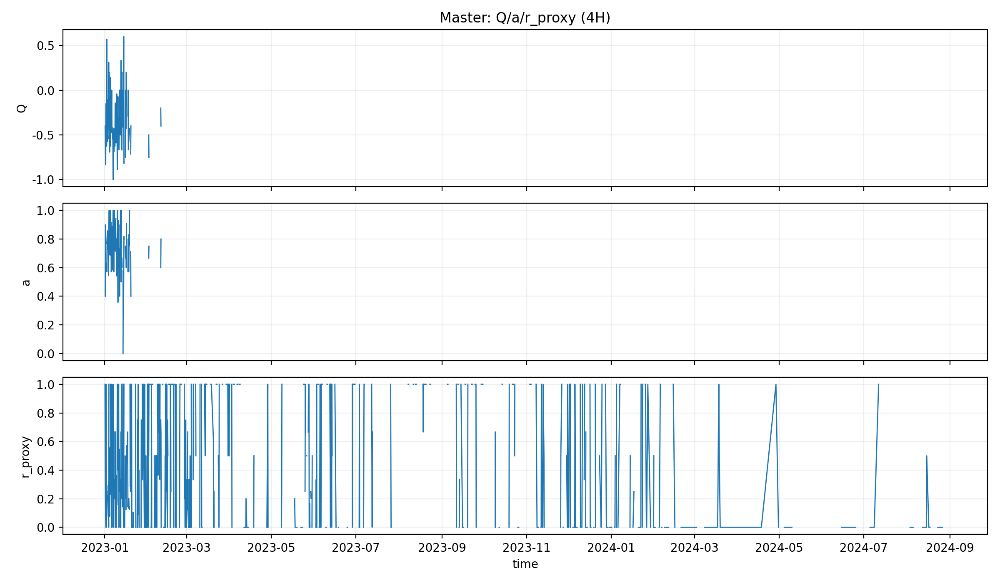
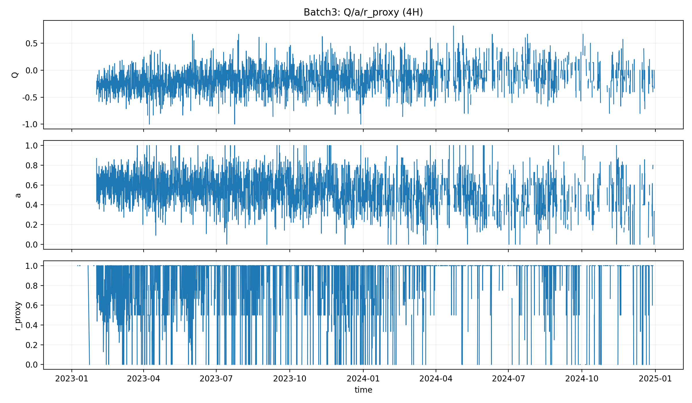
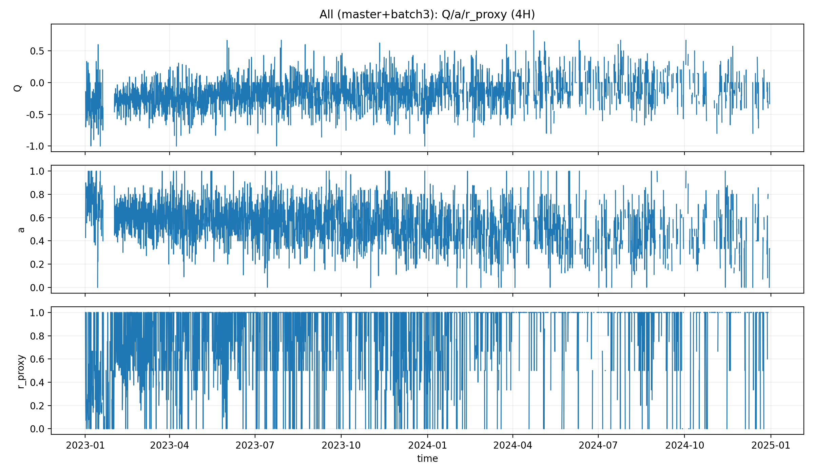

解释要点：
- `r_proxy` 在窗口级会出现大量接近 0/1 的点，这是媒体窗口计数稀疏时“比值离散”的自然结果。我们在 H2/H3 中使用段内计数比值来降低这一噪声源。

### 3.2 H1/H2 散点（按月分段）
- master：`../outputs/figs/empirical/fig7b_h1_h2_scatter_master_4h.png`
- batch3：`../outputs/figs/empirical/fig7b_h1_h2_scatter_batch3_4h.png`
- all：`../outputs/figs/empirical/fig7b_h1_h2_scatter_all_4h.png`

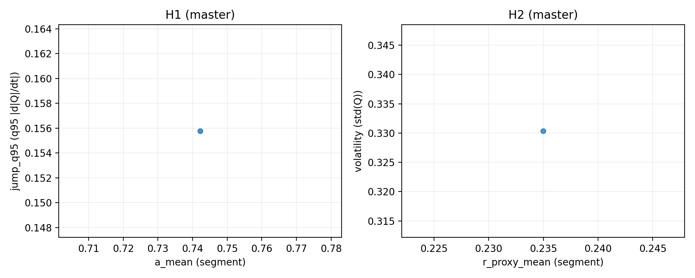
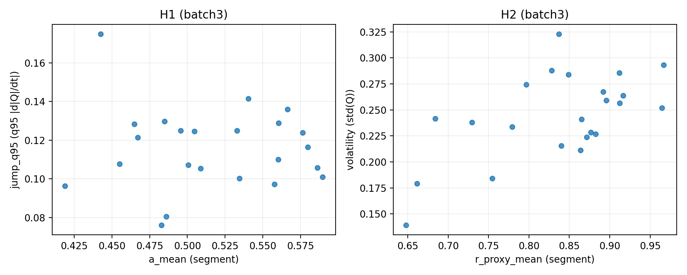
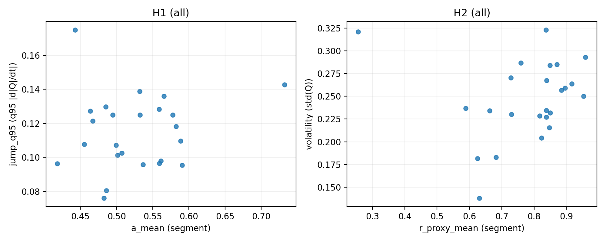

**H1 结论（Activity → Jump）**：
- 在当前“按月段内 `jump_q95`”定义下：batch3 / all **均不显著**，master 因段数过少无法检验。  
  这表明：在当前经验数据与指标口径下，**$a$ 单独不足以解释 jump 强度**；更可能需要条件化（例如在高 $r_{\text{proxy}}$ 条件下看 $a$ 的边际效应），或改用更贴近“状态跃迁”的 jump 定义（后续任务）。

**H2 结论（r_proxy → Volatility）**：
- 在 batch3 上：相关显著为正，支持理论“正反馈占优 → 波动更大”的方向性预测。
- 在 all 上：方向为正但稳健性弱于 batch3（合并后引入更稀疏的 master 部分，会削弱统计功效；另外 all 在 2025 的覆盖来自 batch3，时间截断也会影响显著性）。

> 注：具体数值由脚本打印输出为准（见第 5 节复现命令）。本轮复跑（4H，2023+）中 batch3 的 H2 在 Pearson 与 Spearman 下均显著为正。

### 3.3 H4 事件对齐（AC1(|Q|) 与 Var(|Q|)）
- master：`../outputs/figs/empirical/fig7c_h4_eventstudy_master_4h.png`
- batch3：`../outputs/figs/empirical/fig7c_h4_eventstudy_batch3_4h.png`
- all：`../outputs/figs/empirical/fig7c_h4_eventstudy_all_4h.png`

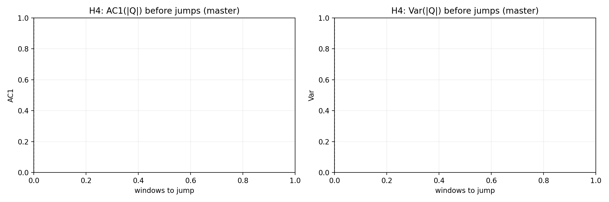
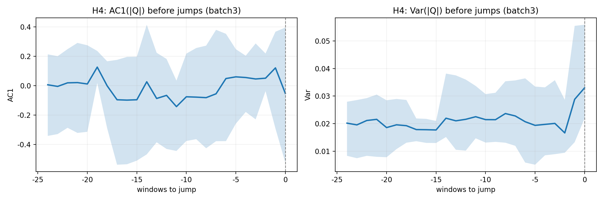
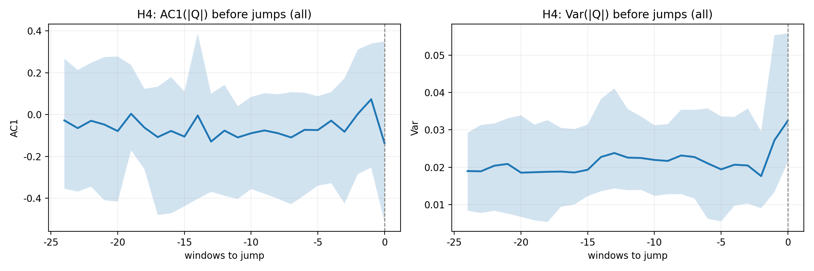

**H4 结论（临界慢化）**：
- 目前只能说：`Var(|Q|)` 在 jump 前有一定抬升迹象，但 `AC1(|Q|)` **并不稳定**（未出现清晰单调上升）。  
  因此 H4 **不能作为强结论写入论文主结果**，更适合以“弱证据/识别困难”方式客观汇报，并把提升数据密度（更连续、更高频、更大样本）作为下一步重点。

## 4. 核心发现（给写作的一句话版本）
1) **最稳健的经验支持来自 H2**：在扩展集 batch3 中，自媒体占比越高（$r_{\text{proxy}}$ 越大），情绪序参量 $Q$ 的段内波动越大（volatility↑），与“正反馈占优导致系统更不稳定”的理论预测一致。  
2) **H1 在当前口径下不成立**：$a$ 与 jump 强度（段内 `jump_q95`）相关接近 0，提示“仅靠中立者缺失度”不足以解释突变，需要更细的条件化检验/更贴近机制的 jump 定义。  
3) **H4 目前证据偏弱**：方差可能有抬升，但 AC1 不稳定；要把临界慢化作为经验事实，需要更连续、更高密度的数据集与更严格的事件定义/对照设计。

## 5. 复现与产出位置

### 5.1 一键复现（推荐）
使用本地 conda 环境：
```bash
/home/wujlin/miniconda3/envs/emotion/bin/python scripts/run_note7_empirical.py \
  --freq 4H \
  --min-posts-public 5 \
  --time-start 2023-01-01 \
  --segment M \
  --roll-win 12 \
  --pre 24
```

### 5.2 产出文件
- 图：`outputs/figs/empirical/fig7a_*_4h.png`、`fig7b_*_4h.png`、`fig7c_*_4h.png`
- 时间序列缓存：`outputs/annotations/derived/time_series_{master,batch3,all}_4h.csv`

## 6. 下一步建议（面向 batch4：上海疫情数据）
你提到的上海疫情数据主要在 **2022 上半年**，且数据量更大（70万+）。这对 H4（CSD）非常关键：更高密度、更连续的序列更可能识别出 AC1/Var 的早期预警。

建议把 batch4 作为“增强验证集”接入后，优先做两类对照：
- 时间窗更细：`freq=1H`，同时提高 `min_posts_public`（例如 50/100），让每个窗口的 $Q/a$ 更稳定
- 时间范围聚焦：例如 `2022-01-01 ~ 2022-06-30`（或更贴近封控窗口）

## 7. 时间团簇分析（方案B：density-based clusters）

### 7.1 方法与输出
团簇定义：对 `n_public` 做 rolling mean 平滑，再按分位数阈值取高密度区间，并做最短长度筛选与小间隔合并。

复现命令（建议 `--cluster-only`，避免输出“全时段混合”的结果图）：
```bash
/home/wujlin/miniconda3/envs/emotion/bin/python scripts/run_note7_empirical.py \
  --freq 4H \
  --min-posts-public 5 \
  --time-start 2019-01-01 \
  --segment M \
  --roll-win 12 \
  --pre 24 \
  --cluster \
  --cluster-only \
  --cluster-roll-days 14 \
  --cluster-quantile 0.9 \
  --cluster-min-days 21 \
  --cluster-merge-gap-days 7 \
  --cluster-max 5
```

输出：
- 团簇汇总表：`outputs/annotations/derived/note07_time_clusters_4h.csv`
- 团簇统计表：`outputs/annotations/derived/note07_cluster_stats_4h.csv`（包含每个团簇的 H1/H2 相关、H4 event 数、以及 H4 placebo p 值等）
- 稳健性栅格表：`outputs/annotations/derived/note07_cluster_grid_stats_4h.csv`（roll_days×quantile）
- 团簇图：`outputs/figs/empirical/fig7a_*_c*_basic_4h.png`、`fig7b_*_c*_4h.png`、`fig7c_*_c*_4h.png`

### 7.2 本轮识别到的团簇（示例）
本轮（`time_start=2019-01-01, freq=4H, cluster_quantile=0.9`）识别到的高密度团簇如下（详见 CSV）：
- master：1 个团簇（约 2022-12 ~ 2023-01）
- batch3：2 个团簇（约 2023-01~03、2023-05~06）
- all：2 个团簇（约 2023-01~04、2023-05~06）

### 7.3 团簇内结果解读（关键）
团簇内的 H1/H2 往往比“全时段混合”更弱，这是合理的：  
若全局相关主要来自“阶段差异”（例如不同阶段 `r_proxy` 与 `volatility` 的整体水平不同），则在每个阶段内部做相关会明显减弱。

因此，团簇分析的价值在于：
- 把“跨阶段的结构性差异”与“阶段内的机制关系”拆开，避免误把结构差异当成理论机制。

### 7.4 团簇图（供快速复核）

**master / cluster0**
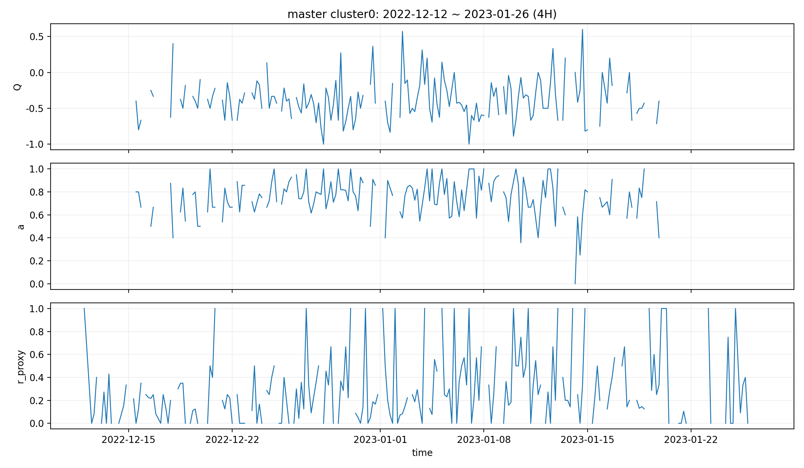
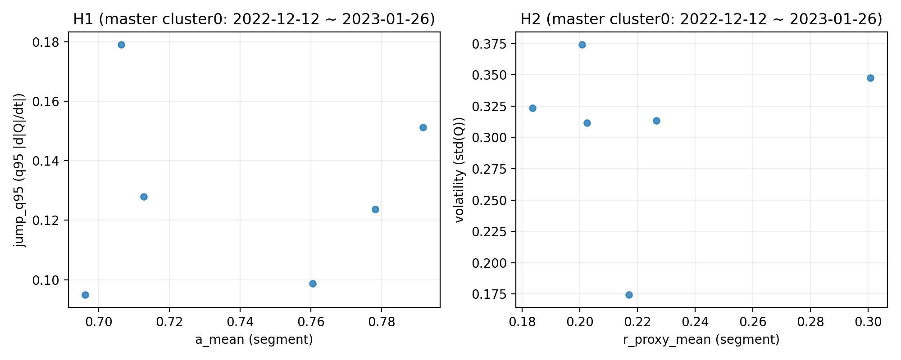
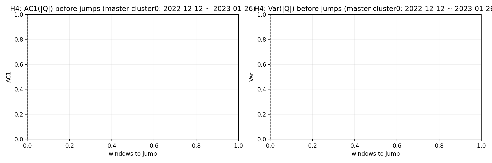

**batch3 / cluster0**
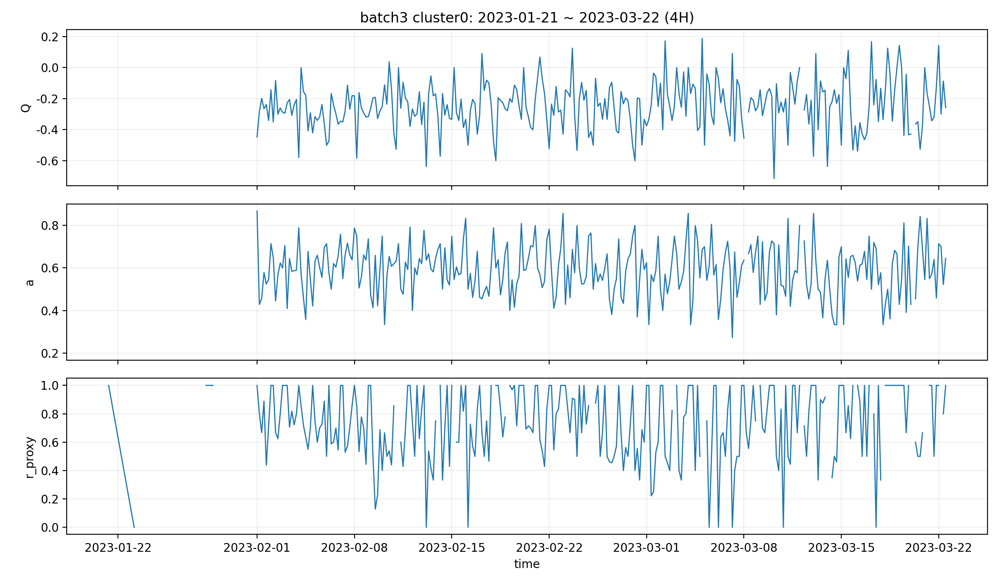
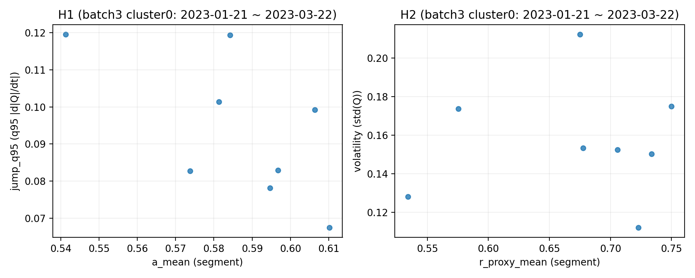
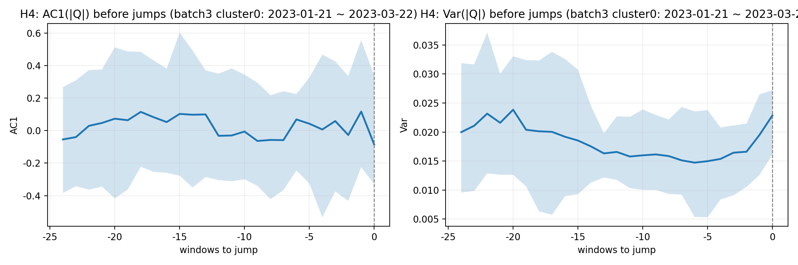

**batch3 / cluster1**
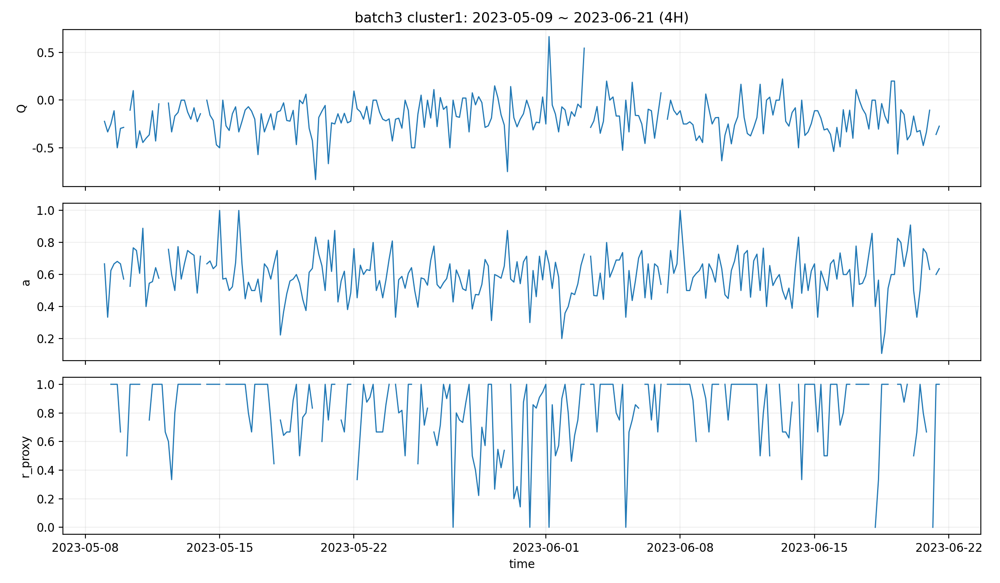
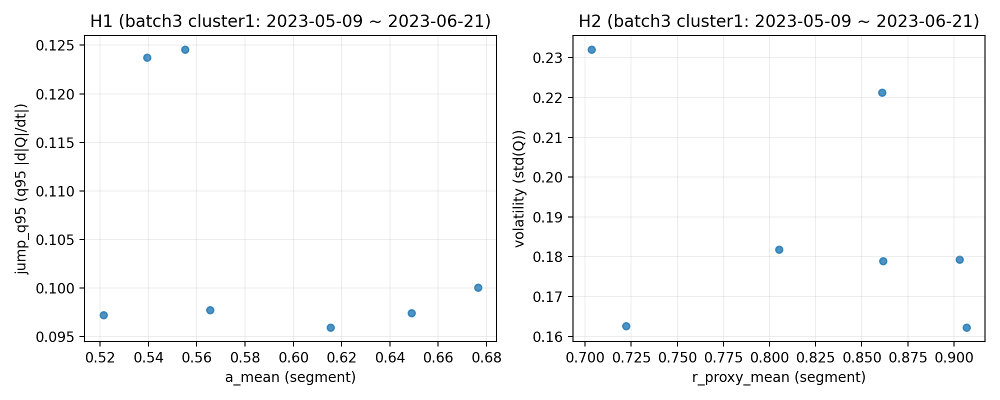
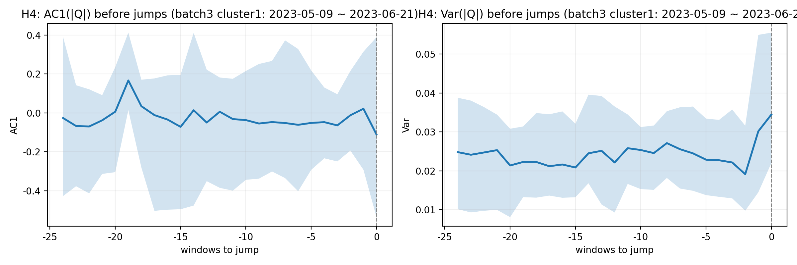

**all / cluster0**
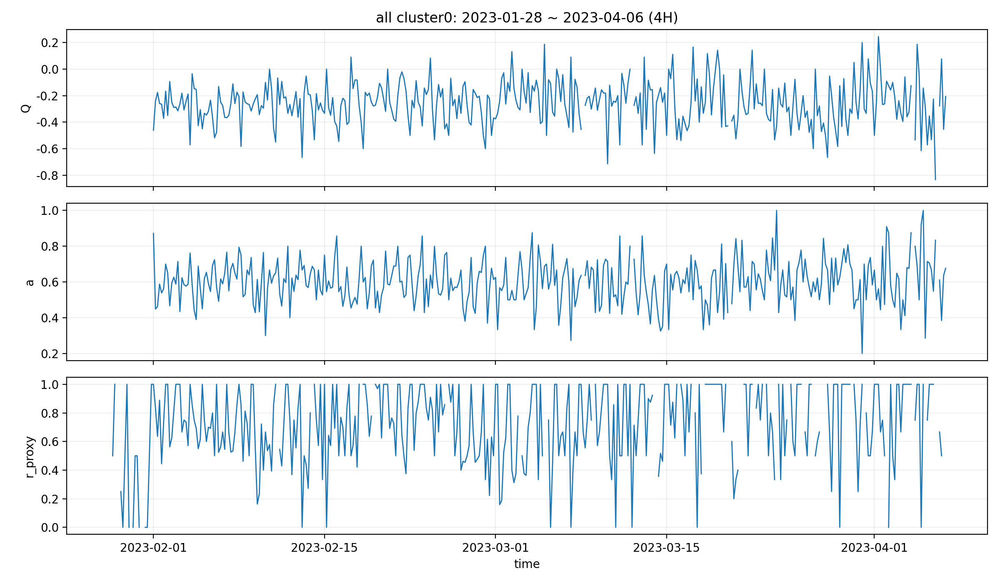
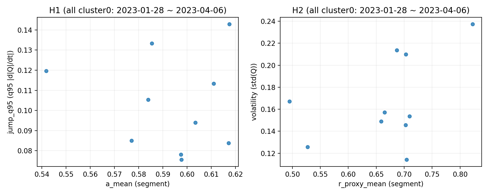
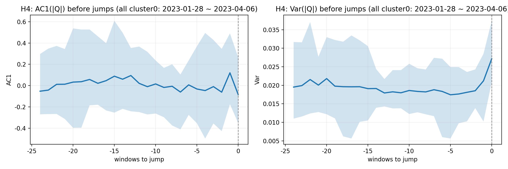

**all / cluster1**
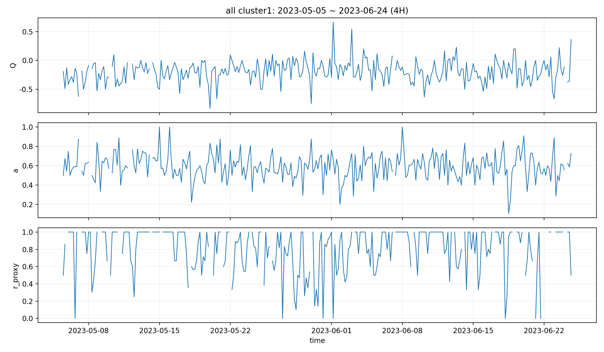
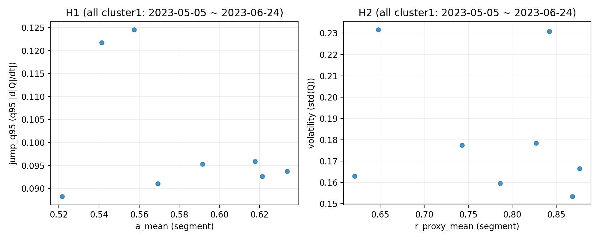
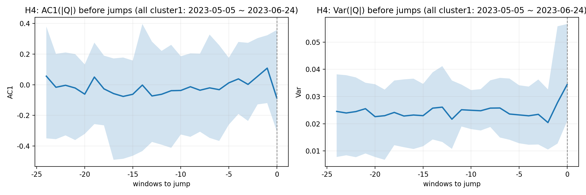

### 7.5 H4 Placebo（避免“看起来像预警”但其实随机）
为回应 “H4 是否只是缺口/窗口选择造成的错觉” 的质疑，脚本在团簇内加入了 **placebo（事件标签置换）**：
- 固定同一团簇内的时间序列与 rolling 指标
- 保持 **block_id 内事件数量分布**不变
- 随机抽取“非事件”窗口作为 placebo 事件点，重复多次，得到统计量分布
- 检验：真实事件前的 AC1/Var（取事件前最后 `k` 个窗口的均值）是否显著高于 placebo（one-sided）

结果表在：`outputs/annotations/derived/note07_cluster_stats_4h.csv`（列：`h4_placebo_*`）。
