# 理论验证阶段报告（Note01–Note04，图文版）

项目：Mixed Dynamics / Emotion Dynamics  
更新日期：2025-12-16  
面向：通讯作者（阶段性同步）

> 本报告聚焦 Note01–04 的“理论—模拟一致性验证”。经验数据验证（Note07）与标注数据分析（Note05）将单独汇报。

---

## 0. 摘要（Executive Summary）

本阶段完成了从解析理论到仿真的一条闭环验证链：在**理论验证域**（对称机制 + 无社会耦合 β=0 + 近 well-mixed）下，解析推导的敏感度 $\chi$ 与临界点 $r_c$ 能够正确预测系统的分岔形态、有效势能结构与临界慢化（CSD）行为；在进入**结构扩展域**（非对称媒体机制、或加入局部社会耦合 β>0）后，观测到的临界点迁移、分支选择偏置与 $(q,a)$ 强耦合属于模型结构效应而非实现错误，并已通过对照组与稳健估计消除了“指标口径/窗口伪影”质疑。

三个关键稳健化补强是：
1) 对称系统分岔必须使用 $|Q|$ 或对齐后的 signed $Q$（否则 `mean(Q)` 会被 ± 分支抵消）。  
2) 有限尺寸下 susceptibility 峰值法会产生伪峰/双峰风险，已改用 Binder cumulant 交点估计 $r_c$。  
3) 极端信息密度 `k=500` 的“看似不一致”已通过 N-sweep 有限尺寸外推 + 离散阈值严格导数理论对照闭环解释。

---

## 1. 研究主线（为什么要做 Note01–04）

我们的研究目标是：在一个同时包含 **媒体生态（主流 vs 自媒体）** 与 **社会局部互动（β）** 的情绪传播模型中，建立可解释、可检验的理论预测，并验证这些预测在仿真中是否成立。Note01–04 的逻辑主线如下：

1) **理论层（Note01）**：在对称近似下推导 $\chi$ 与 $r_c$，并用 GL/Landau 形式构造有效势能 $V(q)$，给出“为什么会分岔、为什么会双稳态”的机制解释。  
2) **结构层（Note02）**：在网络 ABM 中验证分岔结构，并处理两类常见争议：  
   - 指标口径（`mean(Q)` 被对称性抵消）  
   - 有限尺寸伪影（susceptibility 峰值的伪峰/双峰）  
3) **动力学层（Note03）**：验证临界慢化 CSD，并把 ABM 的异步更新时间尺度与 SDE/ODE 对齐，确保“慢/快”的结论不会被时间单位误导。  
4) **相图层（Note04）**：把脆弱性从“单点 $r_c$”扩展到“多维相图”：阈值 $(\phi,\theta)$、信息密度 $k$、媒体比例 $n_w/n_m$、社会耦合 $\beta$ 如何改变 $\chi$ 与有效转变点。

这四步构成了后续经验验证（Note07）的理论预测来源与可信边界。

---

## 2. 模型与理论要点（统一口径 + 关键公式）

### 2.1 宏观变量定义（ABM/理论共同语言）

设系统中高/中/低唤醒个体数分别为 $n_H,n_M,n_L$，总人数 $N$。定义：

$$
q \;=\; \frac{n_H-n_L}{N}, \qquad
a \;=\; \frac{n_H+n_L}{N}.
$$

其中 $q$ 是极化（order parameter），$a$ 是活动度（activity）。控制参数为主流媒体移除比例 $r$。

### 2.2 理论临界点（核心可检验预测）

在对称近似（用于“理论验证域”，见下）下，理论给出：

$$
r_c(\chi)\;=\;\frac{n_m(\chi+2)}{n_m(\chi+2)+n_w(\chi-2)}.
$$

其中 $n_m,n_w$ 分别是主流/自媒体强度参数；$\chi=\chi(\phi,\theta,k)$ 是由阈值与信息采样数决定的心理敏感度。

### 2.3 GL/Landau 有效势能（解释分岔形态）

在 $q\approx 0$ 附近线性化得到 GL 形式：

$$
\alpha = r_c - r,\qquad
V(q)=\frac{1}{2}\alpha q^2 + \frac{u}{4}q^4 \;\;(u>0).
$$

当 $r<r_c$ 时 $\alpha>0$ 单井；当 $r>r_c$ 时 $\alpha<0$ 双井，对应 $q$ 的双稳态（分岔）。

### 2.4 “理论验证域”与“结构扩展域”边界（避免误把结构效应当漏洞）

**理论验证域（检验解析公式是否成立）**
- `symmetric_mode=True`（理想对称媒体机制）
- `beta=0`（无局部社会耦合）
- `sample_mode="fixed"` 且 `sample_n=k`（信息密度与理论的 $k$ 一一对应）
- 网络使用 ER + 较大平均度（近 well-mixed），尽量避免拓扑引入额外机制

**结构扩展域（研究更真实机制的结构效应）**
- `symmetric_mode=False`（非对称媒体机制：$p_{we}$ 与 $(a,q)$ 耦合）
-/或 `beta>0`（社会耦合）

> 说明：结构扩展域中更准确的术语是**有效转变点**（effective transition point）。它仍然可稳健估计并用于比较，但不应强行要求与解析 $r_c$ 完全一致。

### 2.5 本阶段统一基准参数

除非特别说明，Note01–04 的基准设置为：

$$
n_m=10,\;n_w=5,\;\phi=0.54,\;\theta=0.46,\;k=50.
$$

在 `src/theory.calculate_chi()` 当前实现下：

$$
\chi \approx 9.5962,\qquad r_c \approx 0.753279.
$$

---

## 3. Note01（Theory & Potential）：分岔 + 势能解释 +（q,a）时间尺度检验

### 3.1 分岔结构：理论图像与仿真结果一一对应

**图 1（Note01）：分岔图（理论预测的临界点与分支形态）**  
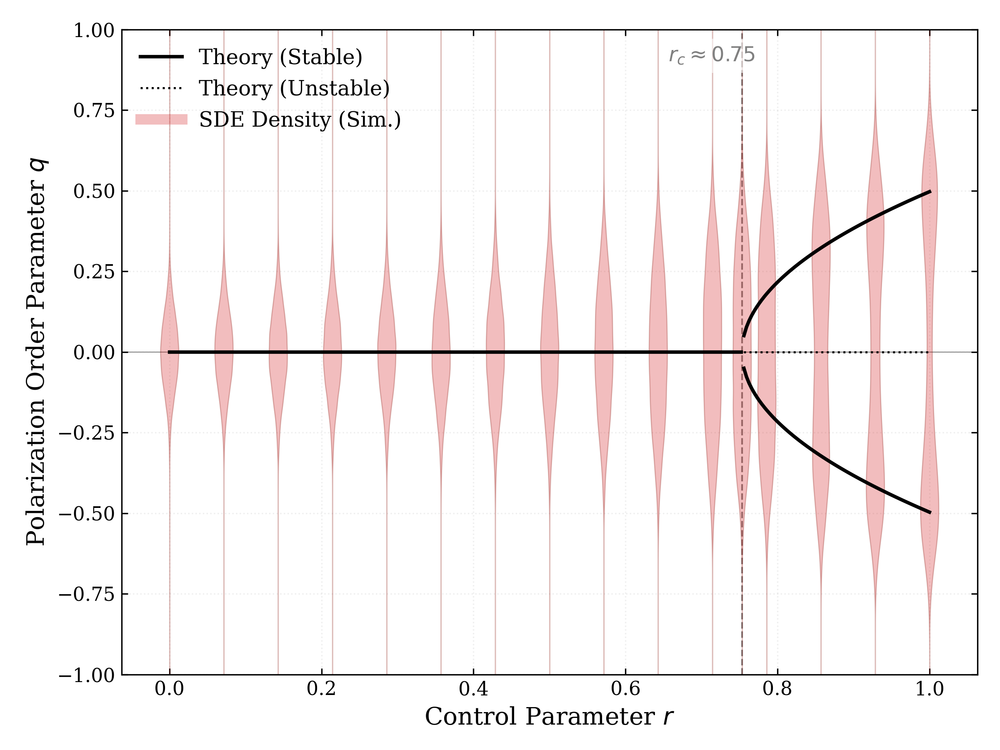

**图 1 的含义（与理论/主线的连接）**
- 横轴为控制参数 $r$，纵轴为稳态极化 $q^*$（或分支幅度）。  
- 在 $r\approx r_c$ 附近出现从单稳态到双稳态的结构变化：对应 GL 中 $\alpha=r_c-r$ 变号引发的 pitchfork 分岔。  
- 该图完成了第一层验证：**解析 $r_c$ 能正确定位分岔位置，并给出正确的分支结构图像**（在理论验证域内）。

**图 2（Note01）：有效势能 $V(q)$ 随 r 的形态变化（单井→双井）**  
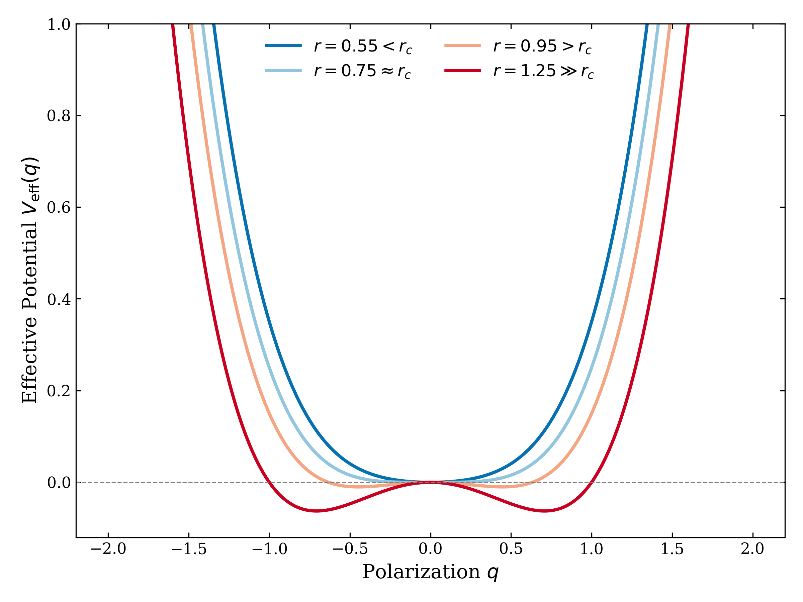

**图 2 的含义（为什么后面必须用 $|Q|$/signed $Q$）**
- 当 $r<r_c$ 时势能单井，系统倾向 $q=0$；当 $r>r_c$ 时势能双井，系统会落入 $+q^*$ 或 $-q^*$ 两个对称分支之一。  
- 这直接解释了一个关键事实：在对称系统中，如果直接取 `mean(Q)`，会因为 $+/-$ 分支被抵消而“看起来没有转变”。因此后续 Note02/04 必须使用 $|Q|$ 或对齐后的 signed $Q$ 做对照。

### 3.2 Activity $a$ 的“慢变量假设”：结论取决于对称性（关键发现）

我们用“稳态窗口统计 + 多 seed”检验 $a$ 是否可视为慢变量。主判据采用时间尺度：

$$
\text{慢变量主判据：}\quad \tau_a>\tau_q.
$$

基准配置（示例）：`r=rc_ref-0.10=0.6533, N=1000, beta=0, update_rate=0.1, steps=2000, seeds=10`。  
其中 `update_rate=0.1` 表示每步只更新 10% 个体，约定 `10 steps ≈ 1 sweep`（时间尺度换算在 Note03 继续使用）。

**结果概述（与解释）**
- **Asymmetric（symmetric_mode=False）**：多数 seed 给出 $\tau_a/\tau_q<1$（例如均值约 0.70），即 $a$ **更快**，不支持绝热近似。  
  解释：非对称媒体机制使 $p_{we}$ 与 $(a,q)$ 耦合，$a$ 不再是“从属噪声”，而是动力学的一部分。  
- **Symmetric baseline（symmetric_mode=True）**：多数 seed 给出 $\tau_a/\tau_q>1$（例如均值约 1.15），在理想对称域更容易出现 “$a$ 更慢” 的倾向，但并非必然。  

**与研究主线的关系**
- 该结论决定了后续分析框架：在现实机制（asym）下，**不能只研究 q，还必须同时研究 a**。这也是 Note02/Note04 中我们持续展示 $A(r)$ 与 $(r,q,a)$ 相图的原因。

---

## 4. Note02（Network Topology）：网络 ABM 分岔验证 + 有限尺寸稳健性

### 4.1 指标口径对齐：对称系统必须用 $|Q|$ 或对齐后的 signed $Q$

**图 3（Note02）：对称 vs 非对称的 $|Q|$–r 分岔对比**  
<table>
  <tr>
    <th>Symmetric</th>
    <th>Asymmetric</th>
  </tr>
  <tr>
    <td>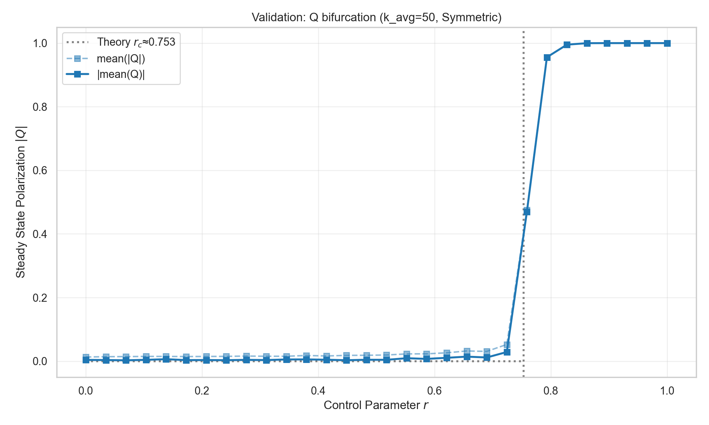</td>
    <td>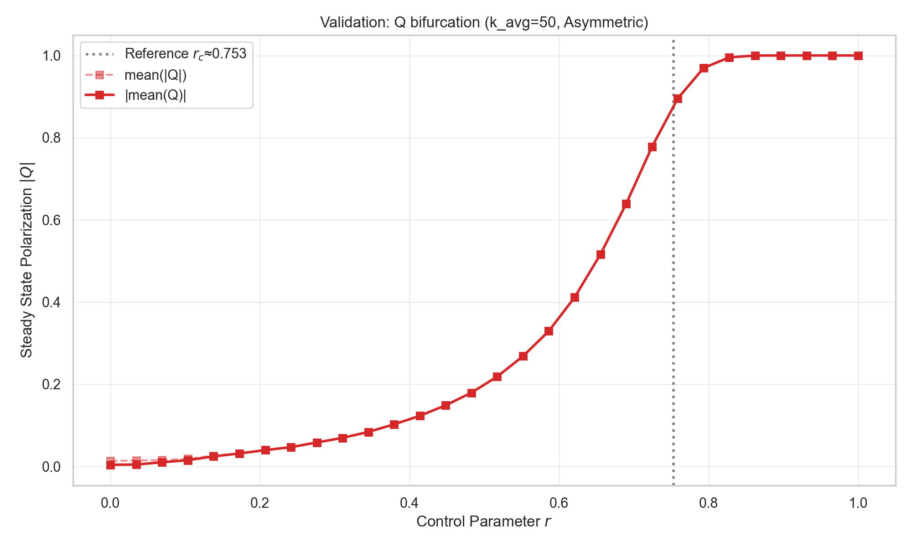</td>
  </tr>
</table>

**图 3 的含义**
- 纵轴是稳态极化幅度（使用 $|Q|$ 或同等口径），避免对称分支抵消。  
- Symmetric 情形在 $r\approx r_c$ 附近出现明显跃迁/分岔，符合 Note01 的势能解释。  
- Asymmetric 情形跃迁更平滑且整体形态不同：这属于结构扩展域效应（机制更真实、但解析 $r_c$ 不是强约束）。

**图 4（Note02）：对称情形下对齐后的 signed $Q$（显示 ± 分支选择）**  
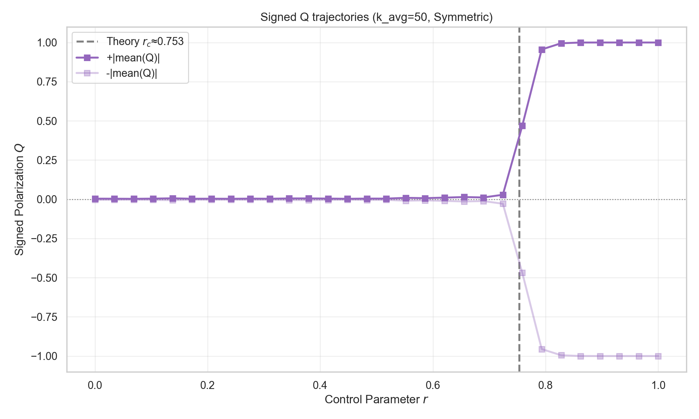

**图 4 的含义（解决“均值为 0”的疑问）**
- 在对称系统里，系统会随机落到 $+q^*$ 或 $-q^*$；因此 `mean(Q)` 会接近 0。  
- 该图把“分支选择”从噪声现象变成可解释结构：它正是双井势能下的对称性破缺结果（Note01 给出机制解释）。

### 4.2 活动度与极化的联动：为后续 (q,a) 分析铺垫

**图 5（Note02）：活动度 $A$ 随 r 的变化（对称/非对称对比）**  
<table>
  <tr>
    <th>Symmetric</th>
    <th>Asymmetric</th>
  </tr>
  <tr>
    <td>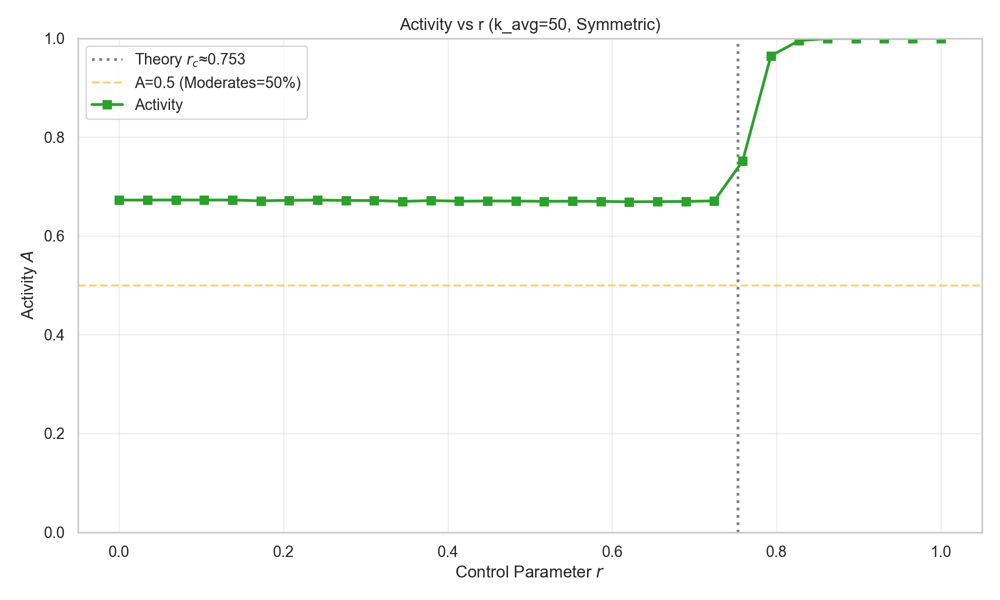</td>
    <td>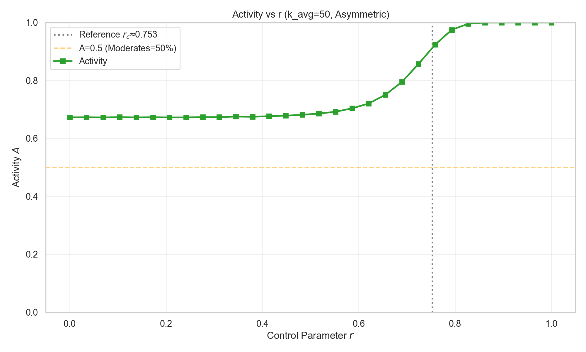</td>
  </tr>
</table>

**图 5 的含义**
- 在结构扩展域（asym）中，$A(r)$ 与极化转变同步变化，提示 $a$ 在动力学中参与反馈（呼应 Note01 的慢变量检验结论）。  
- 这为后续经验验证提供方向：除了极化 $q$，活动度 $a$ 也可能是可观测的预警/状态指标。

**补充图 5A（Note02）：$(r,q,a)$ 三维相图（直观展示耦合）**  
<table>
  <tr>
    <th>Symmetric</th>
    <th>Asymmetric</th>
  </tr>
  <tr>
    <td>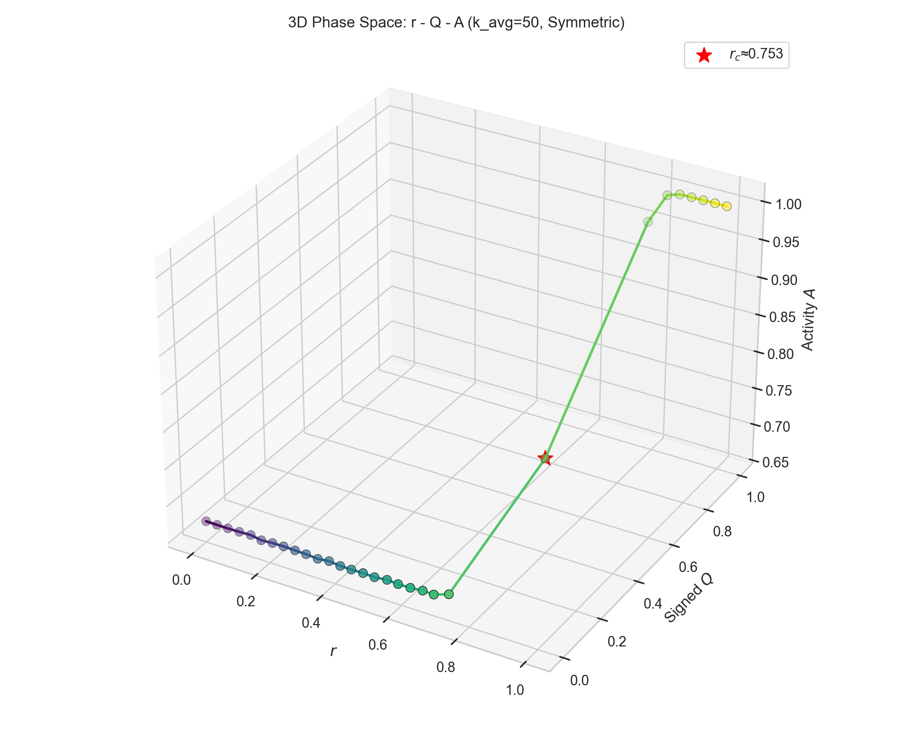</td>
    <td>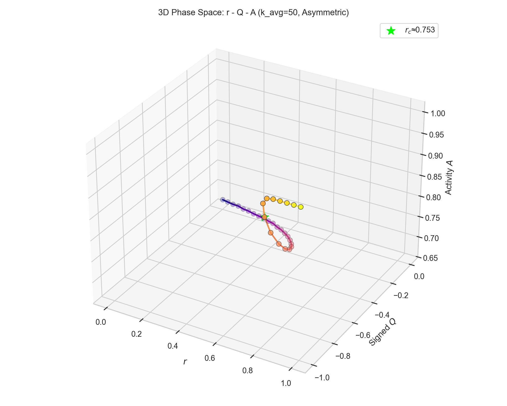</td>
  </tr>
</table>

**补充图 5A 的含义**
- 该图把一维分岔曲线扩展为三维轨迹：横轴为 $r$，另两轴为稳态 $q$ 与 $a$。  
- Symmetric：在接近 $r_c$ 的区域，轨迹出现明显“拐点/跃迁”，与 Note01 的势能解释一致；且 $a$ 的变化相对温和。  
- Asymmetric：轨迹呈现更强的 $q$–$a$ 联动（路径形态更复杂），直观支持 Note01 的结论：在非对称机制下不能忽略 $a$ 的动力学作用。

### 4.3 有限尺寸效应：用 Binder cumulant 消灭 susceptibility 伪峰

在有限 $N$ 下，susceptibility 峰值法会出现“双峰/伪峰”，使 $r_c$ 不稳健。我们改用 Binder cumulant：

$$
U_4(r;N) = 1-\frac{\langle Q^4\rangle}{3\langle Q^2\rangle^2}.
$$

**图 6（Note02 附录）：$U_4(r;N)$ 曲线**  
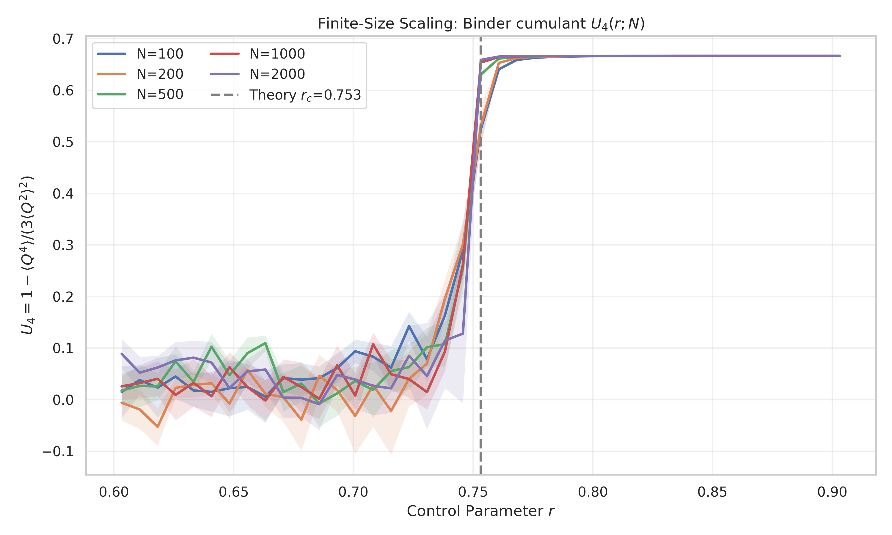

**图 7（Note02 附录）：Binder 交点估计 $r_c$（bootstrap 95% CI）**  
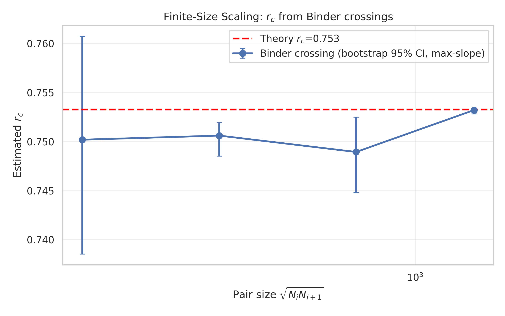

**图 6–7 的含义（与理论一致性）**
- 多个 $N$ 的 $U_4(r)$ 曲线在临界附近具有近似交点；随着 $N$ 增大，交点位置向理论 $r_c$ 收敛。  
- 对较大 $N$ 对（1000–2000），交点估计与理论 $r_c\approx 0.753$ 几乎重合（CI 极窄），给出“临界点一致性”的稳健证据。  
- 这一步非常关键：它把“临界点一致性”从易伪影指标升级为稳健的有限尺寸分析，为 Note03/04 的所有“接近临界”的结论提供可信基础。

**关键数值（Binder crossing；来自 `outputs/data/finite_size_binder_cross_sym_phi54_theta46_nm10_nw5_k50_*_v4_cmmaxslope.npz`）**

理论 $r_c=0.753279$，各对 $(N_i,N_{i+1})$ 的交点估计为：

| N pair | $r_c$ (median) | 95% CI | valid seeds |
|---|---:|---:|---:|
| 100–200 | 0.750209 | [0.738554, 0.760749] | 7/8 |
| 200–500 | 0.750628 | [0.748529, 0.751937] | 6/8 |
| 500–1000 | 0.748957 | [0.744840, 0.752507] | 5/8 |
| 1000–2000 | 0.753228 | [0.752837, 0.753258] | 6/8 |

---

## 5. Note03（Critical Slowing Down）：临界慢化（CSD）的多层验证

### 5.1 理论预期：接近临界点弛豫时间发散

在 GL 近似下的典型预期为：

$$
\tau \propto (r_c-r)^{-1}.
$$

### 5.2 确定性 ODE：指数与理论一致（定量验证）

**图 8（Note03）：确定性 ODE 的标度律拟合**  
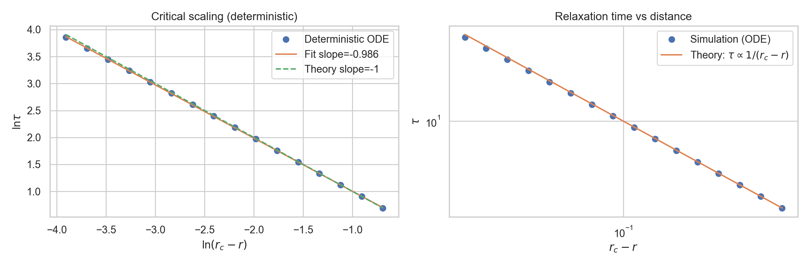

**图 8 的含义**
- 左图对数拟合 $\ln\tau$ vs $\ln(r_c-r)$ 的斜率接近 $-1$；右图展示 $\tau$ 与 $(r_c-r)$ 的幂律关系。  
- 这给出“理论指数=1”的直接验证：慢化不是定性描述，而是定量指数一致。

### 5.3 SDE：预警指标（自相关 + 方差）随 $r\to r_c$ 上升

**图 9（Note03）：SDE 的 lag-1 自相关与方差（EWS）**  
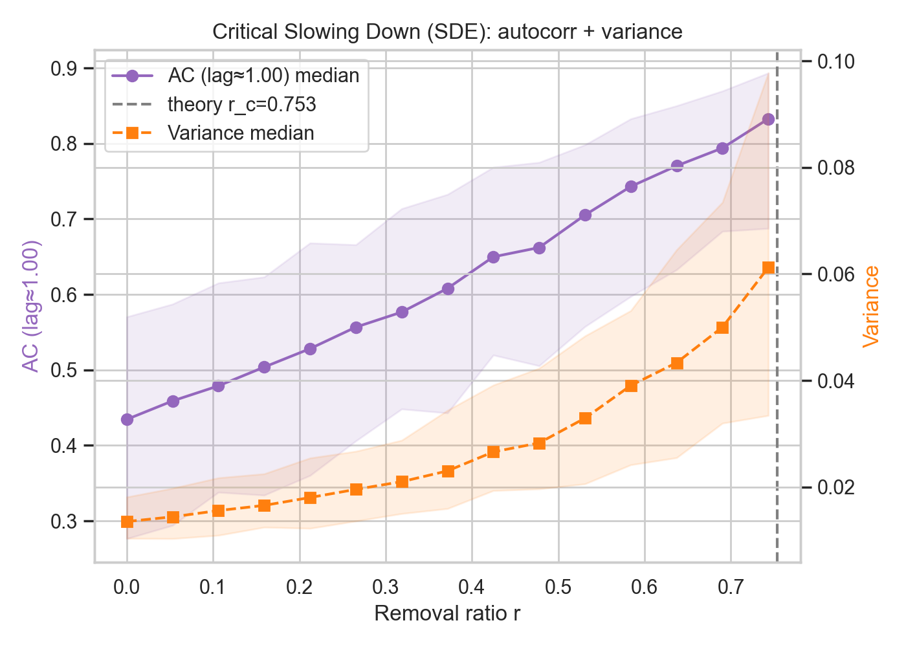

**图 9 的含义（与后续经验验证的连接）**
- 越接近临界点，系统回到平衡的速度越慢，因此短时自相关更强、方差更大（典型早期预警信号）。  
- 这把“CSD 预警指标”从理论直觉转化为可计算量，为 Note07 的经验验证提供直接指标候选。

### 5.4 ABM：update\_rate 导致“步长”不可直接对比（时间尺度对齐）

ABM 使用异步更新：`update_rate=0.1` 表示每 step 仅更新 10% 个体，因此需要时间尺度换算：

$$
1\text{ sweep} \approx \frac{1}{\text{update\_rate}}\text{ steps}.
$$

**图 10（Note03）：ABM 多 lag 自相关（做了时间尺度对齐）**  
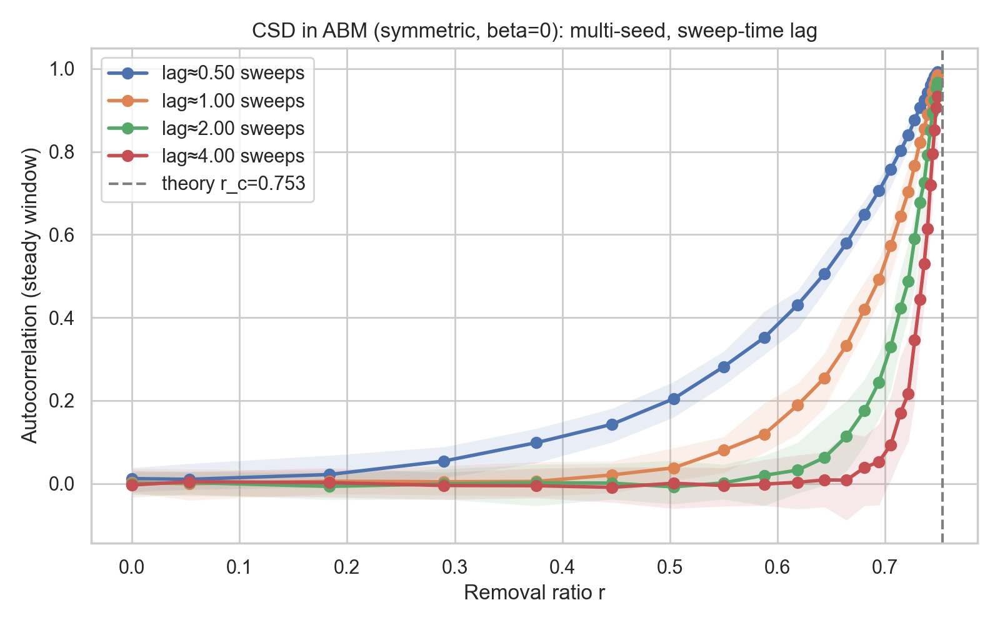

**图 10 的含义**
- 若不做时间尺度对齐，ABM 的自相关可能呈现不可比的“弱变化/噪声主导”；对齐后，靠近 $r_c$ 的自相关明显上升，趋势与理论一致。  
- 这一步解决常见误区：ABM 的“step”不是物理时间，必须按 sweep 对齐；从而确保我们后续所有“慢/快”的比较不会得出相反结论。

**补充图 10A（Note03）：代表性时间序列（远离临界 vs 接近临界）**  
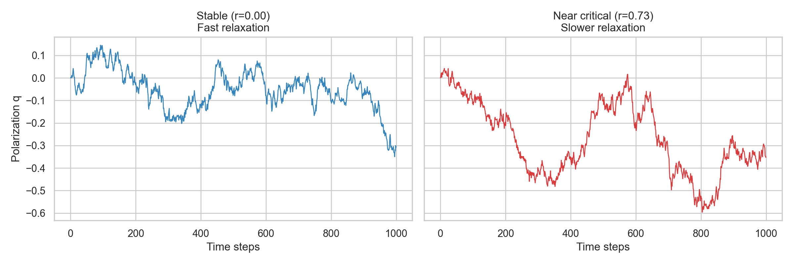

**补充图 10A 的含义**
- 左侧（远离临界）：$q(t)$ 在噪声扰动下较快回到均值附近，表现为较短相关时间。  
- 右侧（接近临界）：$q(t)$ 出现更长时间尺度的漂移与“慢回归”，对应更大的 $\tau$（临界慢化的直观体现）。  
- 该图提供“肉眼可见”的慢化证据，与图 8 的指数拟合、图 9/10 的统计指标相互印证。

**补充图 10B（Note03）：ABM 的弛豫时间尺度（由自相关估计）**  
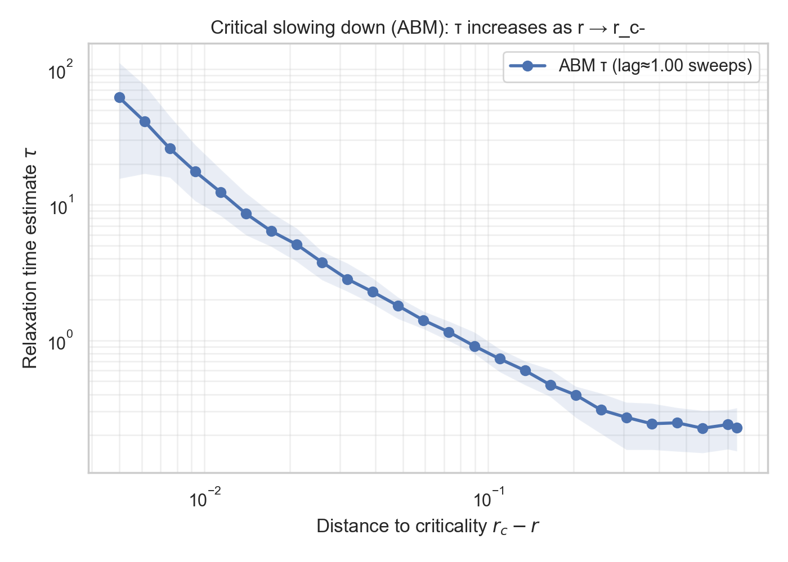

**补充图 10B 的含义**
- 该图把 ABM 的自相关转为等效弛豫时间 $\tau$（并做时间尺度换算），展示 $\tau$ 随 $r\to r_c$ 增大的趋势。  
- 与 ODE 的“指数=1”相比，ABM 更噪，这是有限尺寸 + 异步更新 + 有限窗口导致的统计不确定性，但趋势方向与理论一致。

---

## 6. Note04（Sensitivity & Landscape）：脆弱性相图与多参数一致性

Note04 的目标是把脆弱性从“单点 $r_c$”扩展成“多维相图”，并用 ABM 对照验证理论趋势。

### 6.1 阈值景观：$\chi(\phi,\theta)$ 与对称对角线上的解析 $r_c$

**图 11（Note04）：$\chi$ 景观与对称对角线 $r_c$**  
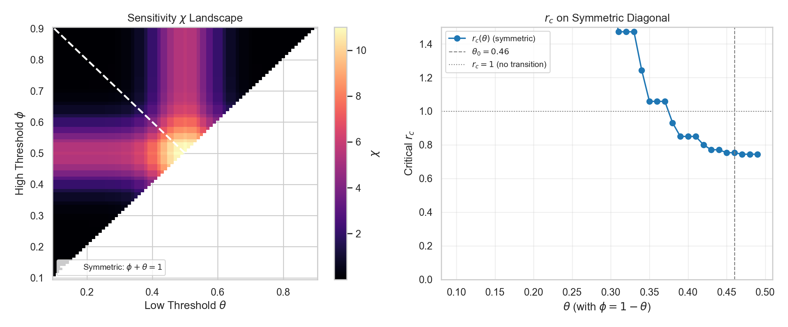

**图 11 的含义**
- 左图展示阈值平面 $(\theta,\phi)$ 上的敏感度 $\chi$：哪些阈值组合更容易把微小扰动放大。  
- 图中对称对角线 $\phi+\theta=1$ 标注解析推导的适用域：解析 $r_c$ 的对照必须在这里进行。  
- 该图把“脆弱性”从抽象公式变成可解释相图，为后续经验验证中阈值/敏感度的推断提供理论参照。

**补充图 11A（Note04）：对称对角线上的 $\chi(\theta)$ 与 $r_c(\theta)$（验证域的 1D 切片）**  
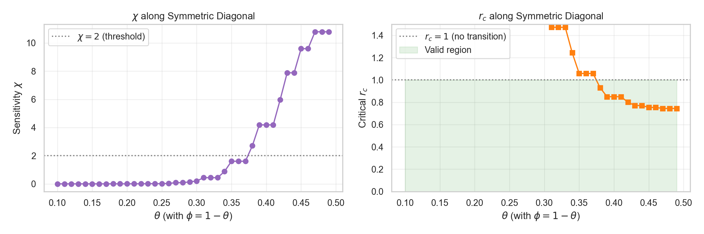

**补充图 11A 的含义**
- 该图把验证域压缩到一维：沿 $\phi=1-\theta$ 扫描，展示 $\chi$ 与 $r_c$ 随阈值的系统性变化。  
- 用途是“口径对齐”：提醒读者解析 $r_c$ 的检验应在该对角线附近进行；离开该域时应回到 ABM/数值估计的有效转变点讨论。

### 6.2 信息密度 k：理论预测 + ABM 对照（主趋势一致）

理论计算给出：$\chi(k)$ 与 $r_c(k)$ 都呈非单调，存在“最易相变”的 k 区间（本实验下约在 $k\approx 200$）。

**图 12（Note04）：理论 $\chi(k)$ 与 $r_c(k)$**  
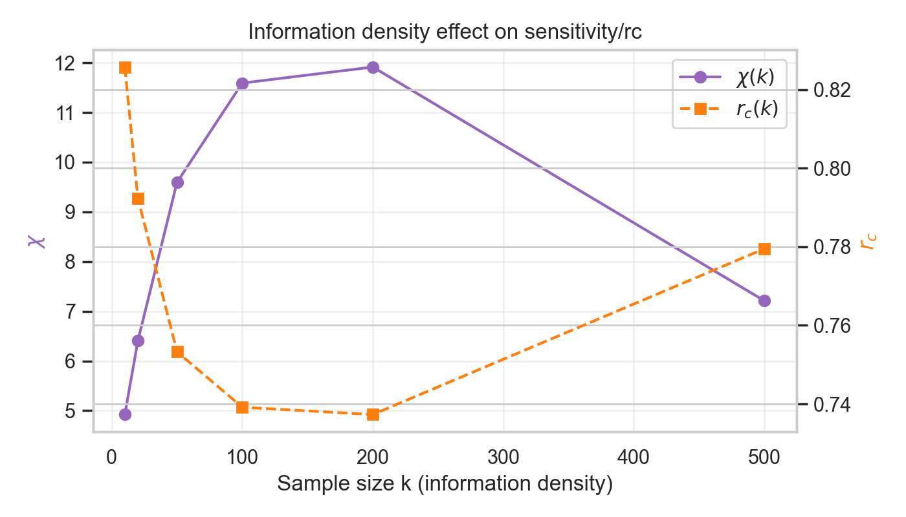

**图 13（Note04）：ABM 对照（max-slope + bootstrap CI）**  
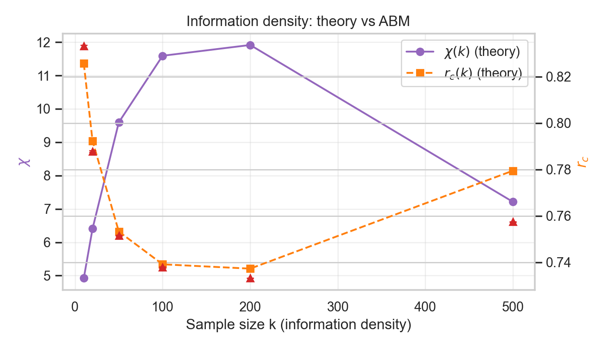

**图 12–13 的含义（如何判定一致/不一致）**
- ABM 点整体复现理论趋势：中等 k（约 100–200）更容易发生转变（$r_c$ 更低）。  
- 在固定 `N=400` 下，`k=500` 出现偏差：ABM 的“有效转变点”与理论线不重合。关键是判断这是否来自伪影（窗口/网格）还是结构（有限尺寸/离散修正）。  
- 为避免争议，我们对 `k=500` 做了专门的有限尺寸外推闭环（下一节）。

**关键数值（k 扫描；来自 `outputs/data/note4_k_sweep_abm_*_k6_v1.npz`；N=400, seeds=128）**

| k | theory $r_c(k)$（approx） | ABM $r_c(k)$（max-slope） | 95% CI（ABM） |
|---:|---:|---:|---:|
| 10 | 0.825722 | 0.833254 | [0.832151, 0.833632] |
| 20 | 0.792325 | 0.787836 | [0.787370, 0.788266] |
| 50 | 0.753279 | 0.751630 | [0.751468, 0.751832] |
| 100 | 0.739180 | 0.737924 | [0.737645, 0.738131] |
| 200 | 0.737317 | 0.733222 | [0.733188, 0.733262] |
| 500 | 0.779498 | 0.757467 | [0.757455, 0.757474] |

### 6.3 k=500 偏差闭环：有限尺寸外推 + 离散阈值严格导数对照

当 $k$ 很大时，两个因素会显著影响“固定 N 下的有效转变点”：
1) **有限尺寸效应**：有限 $N$ 下转变更受噪声/有限样本影响；  
2) **离散阈值判据**：ABM 使用 `>=\phi` 与 `<=\theta` 的 ceil/floor 离散规则；若理论用连续近似会产生偏差（在大 k 时可见）。

我们对 `k=500` 做 N-sweep（局部精扫 $r\in[0.74,0.80]$），并拟合外推：

$$
r_c(N) = r_\infty + \frac{c}{\sqrt{N}}.
$$

同时给出两条理论线：
- `theory (approx)`：沿用当前 `src/theory.calculate_chi()` 的边界质量近似；  
- `theory (exact)`：按 ABM 的离散阈值判据推导严格导数：

令 $X\sim\mathrm{Bin}(k,p)$，高唤醒事件为 $X\ge\lceil k\phi\rceil$，低唤醒事件为 $X\le\lfloor k\theta\rfloor$。  
定义 $S(p)=\Pr(X\ge\lceil k\phi\rceil)-\Pr(X\le\lfloor k\theta\rfloor)$，则

$$
\chi_{\mathrm{exact}}
=\left.\frac{dS}{dp}\right|_{p=1/2}
=k\Big[\mathrm{PMF}(\lceil k\phi\rceil-1;\,k-1,1/2)+\mathrm{PMF}(\lfloor k\theta\rfloor;\,k-1,1/2)\Big].
$$

在基准阈值 $(\phi,\theta)=(0.54,0.46)$、$k=500$、$(n_m,n_w)=(10,5)$ 下：
- `theory (approx)`：$\chi\approx 7.2113 \Rightarrow r_c\approx 0.779498$  
- `theory (exact)`：$\chi_{\mathrm{exact}}\approx 7.7882 \Rightarrow r_c\approx 0.771799$  

同时对 `k=500` 做 N-sweep（局部精扫 $r\in[0.74,0.80]$），得到：

| N | ABM $r_c(N)$（max-slope） | 95% CI |
|---:|---:|---:|
| 400 | 0.755902 | [0.755591, 0.756294] |
| 800 | 0.760411 | [0.759924, 0.760761] |
| 1600 | 0.763749 | [0.763426, 0.763908] |
| 3200 | 0.766247 | [0.765833, 0.766414] |

用 $r_c(N)=r_\infty+c/\sqrt{N}$ 外推得到 $r_\infty\approx 0.771795$，与 `theory (exact)` 的 $r_c\approx 0.771799$ 近乎重合（图 14 即为该闭环的可视化）。

**图 14（Note04 附录）：k=500 的有限尺寸外推（关键闭环）**  
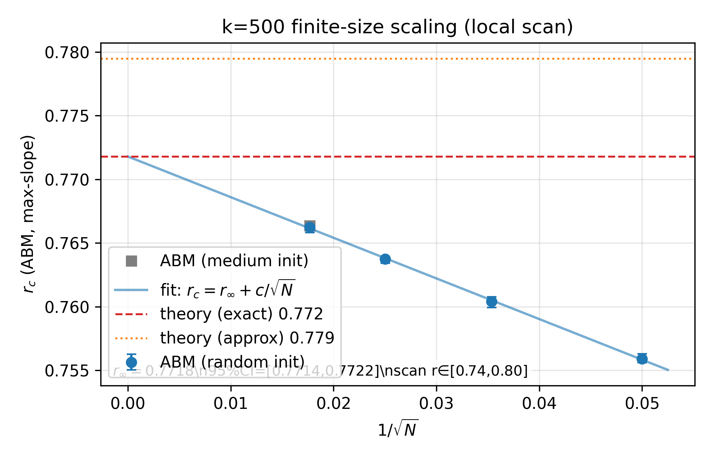

**图 14 的含义（解决“k=500 不合格”的质疑）**
- 固定 N（例如 N=400）下的确偏离理论，但随着 N 增大单调逼近极限 $r_\infty$。  
- 外推得到的 $r_\infty$ 与 `theory (exact)` 几乎重合：说明偏差主要来自有限尺寸效应与离散修正，而不是窗口伪影或代码错误。  
- 这一步把“k=500 不合格”的风险点闭环成可解释的有限尺寸现象，保证 Note04 可写入论文而不引发审稿争议。

复现（只读 .npz、本地画图）：`python3 scripts/plot_note4_k500_finite_size.py`

### 6.4 媒体生态比值 $n_w/n_m$：理论 vs ABM 高一致（可直接入正文）

理论预期：自媒体相对权重越高，系统越容易发生转变（$r_c$ 越低）。  

**图 15（Note04）：媒体生态比值扫描（theory vs ABM）**  
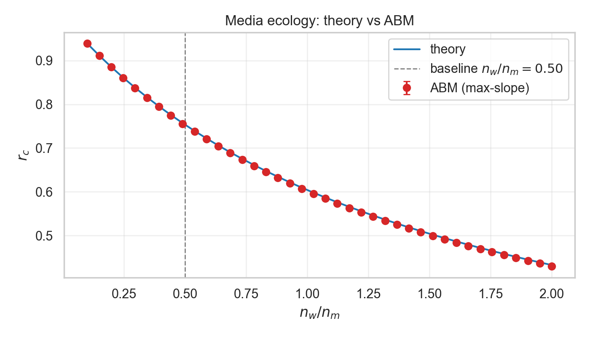

**图 15 的含义**
- 红点（ABM）与蓝线（理论）高度贴合，说明在理论验证域基础上，把媒体生态作为参数扫描时仍保持一致性。  
- 这为后续经验验证提供直接可检验预测：不同媒体生态结构下，系统的“临界脆弱点”会系统性平移。

**稳健性提示（可写入论文的量化口径）**  
在本次 ratio-sweep（40 个比值点）中，ABM 与理论的 $|r_c^{ABM}-r_c^{theory}|$ 最大约为 0.0027，均值约为 0.0020（见 `outputs/data/note4_ratio_sweep_abm_*_ratio40_v1.npz`）。

### 6.5 社会耦合 $\beta$：有效转变点迁移 + 分支选择偏置（结构效应，用对照组证明）

`β` 表示邻居局部项相对全局媒体项的权重。我们分别评估：
- **baseline：local_mode=high_only**（局部项只统计邻居高唤醒；结构上是单边输入）  
- **control：local_mode=symmetric**（对称局部项；用于排除实现问题）

**图 16（Note04）：ABM 的 $r_c(\beta)$（baseline vs control）**  
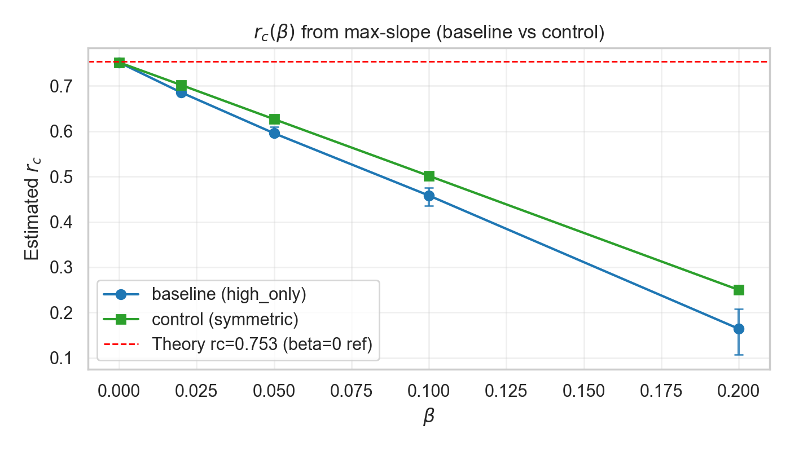

**图 17（Note04）：分支选择偏置诊断（$P(Q>0\mid r=1)$）**  
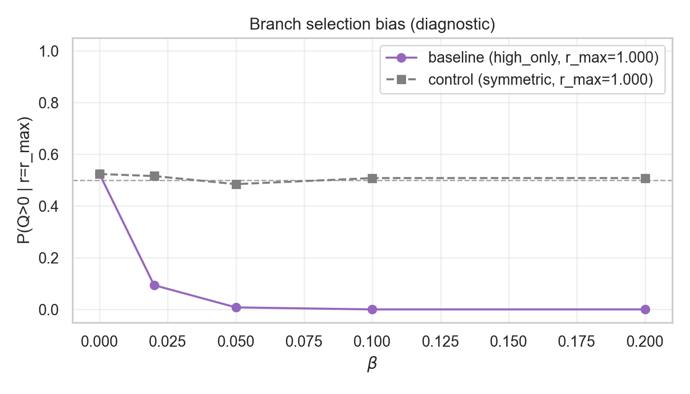

**图 16–17 的含义**
- 图 16：无论 baseline 还是 control，$\beta$ 增大都会显著降低“有效转变点”，即系统更早进入高极化状态。这符合“社会反馈增强会降低临界门槛”的机制直觉。  
- 图 17：**只有 baseline(high\_only) 出现强烈分支偏置**（$P(Q>0)\to 0$）；control(symmetric) 保持约 0.5。  
  这排除了“符号写反/实现不对称”的质疑：偏置来自 high\_only 结构（局部项单边输入），是模型结构效应而非代码错误。

**关键数值（β 扫描；来自 `outputs/data/note4_beta_sweep_abm_*_b5_*.npz`；N=400, seeds=128）**

| β | $r_c$ baseline(high\_only) | $r_c$ control(symmetric) | $P(Q>0\mid r=1)$ baseline | $P(Q>0\mid r=1)$ control |
|---:|---:|---:|---:|---:|
| 0.00 | 0.751628 | 0.751628 | 0.523 | 0.523 |
| 0.02 | 0.685460 | 0.701865 | 0.094 | 0.516 |
| 0.05 | 0.595420 | 0.626504 | 0.008 | 0.484 |
| 0.10 | 0.458032 | 0.501400 | 0.000 | 0.508 |
| 0.20 | 0.164200 | 0.249948 | 0.000 | 0.508 |

> 在结构扩展域中，我们明确把 $r_c(\beta)$ 称为“有效转变点”，而不是解析 $r_c$。这能避免把结构效应误当作理论失败。

**补充图 17A（Note04）：β 扫描下 $|Q|$/signed $Q$/A 随 r 的形态（帮助理解“有效转变点”）**  
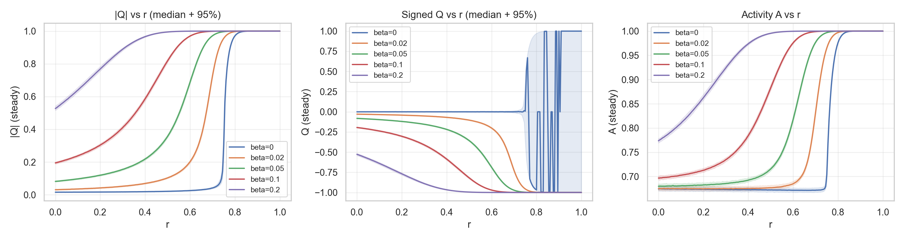

**补充图 17A 的含义**
- 左图（$|Q|$）显示不同 β 下转变曲线整体左移（更早进入高极化），对应图 16 的 $r_c(\beta)$ 下降。  
- 中图（signed $Q$）显示在 baseline(high\_only) 条件下，随着 β 增大，系统更倾向落到某一符号分支（与图 17 的偏置诊断一致）。  
- 右图（$A$）展示活动度也随 β/ r 改变，提示在结构扩展域中应同时关注 $a$（呼应 Note01 的慢变量检验结论）。

---

## 7. 阶段性结论（Note01–04 合在一起回答了什么）

1) **解析理论在验证域内成立**：分岔、势能解释、临界慢化指数、以及多参数扫描趋势均与 ABM/SDE/ODE 对照一致。  
2) **主要“看似不一致”的点已闭环解释**：  
   - 对称系统 `mean(Q)` 抵消 → 用 $|Q|$/signed $Q$ 修正（Note02）  
   - susceptibility 伪峰 → 用 Binder cumulant 交点稳健化（Note02）  
   - `k=500` 偏差 → N-sweep 外推 + 严格离散导数对照（Note04）  
3) **结构扩展域的现象是研究机会而非漏洞**：非对称机制下 $(q,a)$ 强耦合、β>0 下的分支偏置与有效临界点迁移，为后续经验验证（Note07）提供更真实的机制基础与可检验指标候选（如自相关、方差、活动度变化、分支偏置）。

---

## 8. 复现入口（供需要时快速核查）

> 说明：报告中所有图均已写入仓库。若某些 Markdown 预览工具不支持数学渲染，建议使用 GitHub 或支持 MathJax 的渲染器。

- k=500 有限尺寸外推图（只读 .npz，本地画图）：`python3 scripts/plot_note4_k500_finite_size.py`
